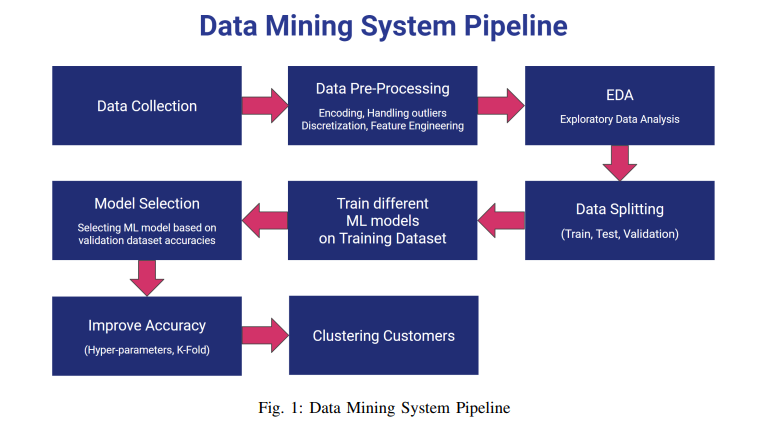
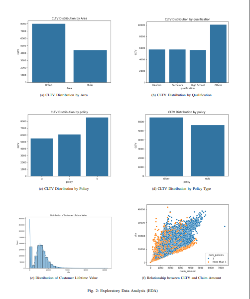
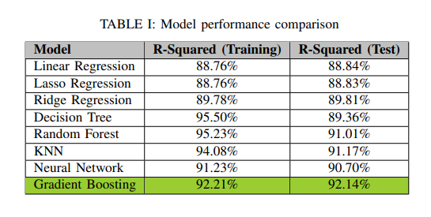
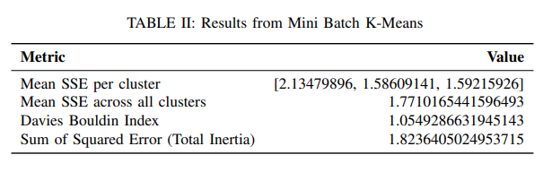
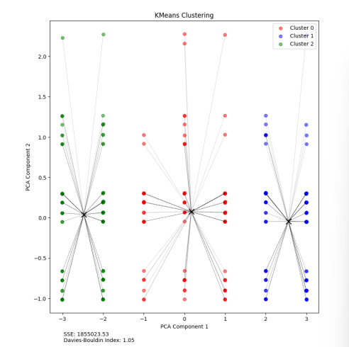

# Unlocking Future Value: Optimizing Insurance Offerings with CLTV Prediction and Customer Segmentation

## Project Overview
This project focuses on developing a predictive model to estimate Customer Lifetime Value (CLTV). By utilizing machine learning techniques such as Gradient Boosting and clustering algorithms like Mini Batch K-Means and BIRCH, the model aims to enhance personalized insurance policies and optimize resource allocation. This initiative seeks to improve customer segmentation, marketing strategies, and overall customer satisfaction, driving data-driven, customer-centric practices in the insurance industry.

## Here’s how it works:

Data Collection: Gather comprehensive customer data from various sources.

Data Preprocessing: Clean and prepare data by encoding variables, normalizing columns, and reducing multicollinearity.

Exploratory Data Analysis (EDA): Identify trends and patterns using distribution analysis, correlation matrices, and visualizations.

Model Training and Selection: Train and select the most accurate machine learning model to predict Customer Lifetime Value (CLTV).

Hyperparameter Tuning: Optimize model performance with hyperparameter tuning and cross-validation.

Customer Segmentation: Use clustering algorithms to segment customers based on predicted CLTV.

Application of Insights: Personalize insurance policies and improve resource allocation and customer satisfaction with tailored strategies.

## Screenshots

## Results

